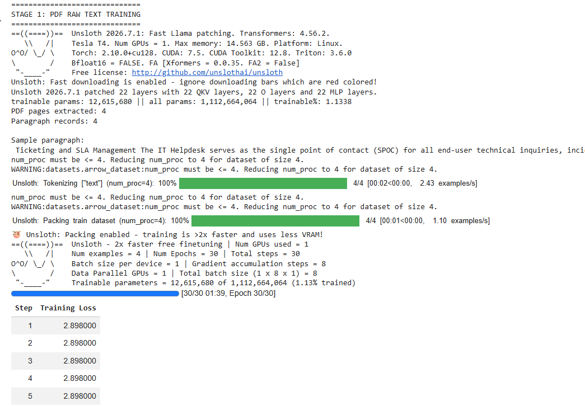
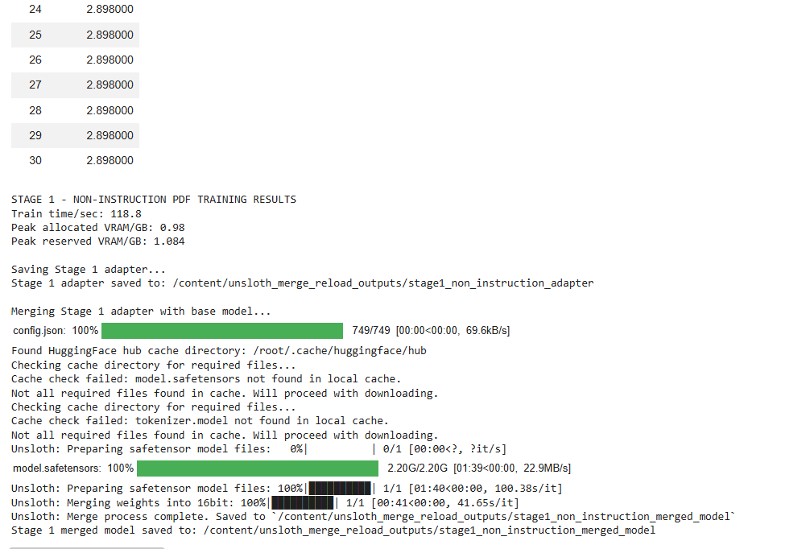

# IT Helpdesk LLM Fine-Tuning using LoRA, QLoRA, SFT, and DPO

## 1. Project Title

**Enterprise IT Helpdesk Assistant using Parameter-Efficient Fine-Tuning (PEFT)**

---

# 2. Domain Selected

**Enterprise IT Support / IT Helpdesk**

The project focuses on adapting a general-purpose Large Language Model (LLM) into an IT Helpdesk assistant capable of answering organization-specific technical support queries related to:

- Password reset
- Email troubleshooting
- Laptop issues
- Printer issues
- Wi-Fi connectivity
- Software installation
- File recovery
- Hardware requests
- Cybersecurity awareness (Phishing)

---

# 3. Business Problem

General-purpose LLMs often generate:

- Generic responses
- Hallucinated information
- Incorrect troubleshooting steps
- Non-enterprise workflows
- Irrelevant links and fabricated contact information

These limitations make them unsuitable for deployment as an internal IT Helpdesk assistant.

The objective of this project is to fine-tune an open-source LLM using enterprise IT Helpdesk data so that it produces:

- Organization-specific responses
- Accurate troubleshooting guidance
- Better instruction following
- Human-preferred responses using DPO

---

# 4. Dataset Details

The project uses three datasets representing different stages of model training.

## 1. Non-Instruction Dataset

Plain IT knowledge without prompt-response formatting.

Example:

```
Windows Update fixes security vulnerabilities.

Restart your computer after installing updates.
```

Purpose:

- Domain adaptation
- Continued pretraining
- IT terminology learning

---

## 2. Instruction Dataset

Formatted as Instruction → Response.

Example

```
Instruction:
How do I reset my password?

Response:
Go to the password reset portal.
Verify your identity.
Create a new password.
```

Purpose:

- Teach the model to follow user instructions
- Improve conversational abilities

---

## 3. Preference Dataset (DPO)

Each example contains:

- Prompt
- Chosen Response
- Rejected Response

Example

```
Prompt:
How do I report phishing?

Chosen:
Report it to the IT Security Team immediately.

Rejected:
Call the local police.
```

Purpose:

Train the model to prefer responses that align with enterprise IT policies.

---

# 5. Base Model Used

**unsloth/tinyllama-bnb-4bit**

Features

- A TinyLlama model is a open-source LLM, specifically optimized for efficiency.
- Designed for 4-bit quantization, enabling reduced memory usage.
- From the Unsloth library, known for faster fine-tuning on consumer GPUs.
- Suitable for applications where a small, fast, and efficient language model is desired.

---

# 6. Non-Instruction Fine-Tuning Approach

Objective:

Adapt the model to the IT Helpdesk domain.

Method:

- Continue training on plain IT documentation
- No instruction-response format
- Learn enterprise terminology and concepts

Expected Outcome

- Better domain knowledge
- Improved understanding of IT vocabulary

---

# 7. Instruction Fine-Tuning (SFT)

Objective:

Teach the model to answer user questions correctly.

Training Data:

```
Instruction
↓
Expected Response
```

Method:

- Supervised Fine-Tuning (SFT)
- LoRA adapters
- QLoRA quantization
- Cross-entropy loss

Outcome:

- Better question answering
- Improved instruction following
- More task-oriented responses

---

# 8. DPO Alignment Approach

Objective:

Improve response quality using human preferences.

Training Format:

```
Prompt

Chosen Response

Rejected Response
```

Method:

Direct Preference Optimization (DPO)

Advantages:

- Learns preferred responses
- Avoids Reinforcement Learning (RLHF)
- Produces more natural responses
- Better alignment with enterprise expectations

---

# 9. LoRA / QLoRA Configuration

| Parameter | Value |
|-----------|------:|
| Fine-Tuning Method | QLoRA |
| Quantization | 4-bit |
| LoRA Rank (r) | 16 |
| LoRA Alpha | 32 |
| LoRA Dropout | 0.05 |
| Learning Rate | 2e-4 |
| Batch Size | 4 |
| Optimizer | AdamW |
| Precision | bfloat16 |
| PEFT Library | LoRA |

---

# 10. Training Screenshots / Logs
## STAGE 1: PDF RAW TEXT TRAINING Screenshots



STAGE 2 - INSTRUCTION FINE-TUNING RESULTS


STAGE 3: LOAD STAGE 2 MERGED MODEL AND DPO


---

# 11. Before vs After Output Comparison

## Base Model
- Generic responses
- Hallucinated answers
- Fabricated contact details
- Incorrect troubleshooting
- Poor enterprise alignment


---

## Base Model vs SFT Model
SFT Model Improvements:

- Better instruction following
- More structured answers
- Better IT workflow understanding

Remaining Issues

- Repetition
- Placeholder information
- Occasional hallucinations


---

## Base Model vs SFT Model vs DPO Model

DPO Model Improvements:

- More natural responses
- Better troubleshooting
- Improved security recommendations
- Better human preference alignment


---

## Overall Summary

| Model | Strengths | Weaknesses |
|-------|-----------|------------|
| **Base Model** | Occasionally provides basic troubleshooting suggestions. | Frequently hallucinates information, is repetitive, generic, and not aligned with enterprise IT Helpdesk workflows. |
| **SFT Model** | Produces more domain-specific responses and follows IT Helpdesk workflows more closely. | Still contains repetitive text, placeholder information, and occasional hallucinations. |
| **DPO Model** | Generates more natural, detailed, and helpful explanations for several troubleshooting scenarios. | Sometimes invents unsupported information, includes irrelevant links, or gives inaccurate enterprise-specific guidance. |

## Overall Winner

| Model | Best Responses |
|-------|---------------:|
| **Base Model** | 0 |
| **SFT Model** | 3 |
| **DPO Model** | 5 |
| **None** | 1 |

**Conclusion:** The **DPO Model** produces the strongest overall responses, particularly for troubleshooting and security-related questions. However, the **SFT Model** performs better for organization-specific IT Helpdesk workflows such as hardware requests and Wi-Fi access. Both models would benefit from further fine-tuning using organization-specific IT support data or integration with a Retrieval-Augmented Generation (RAG) system.

---

# 12. Final Observations

- Fine-tuning significantly improved domain relevance.
- QLoRA enabled efficient training on limited GPU hardware.
- SFT improved instruction-following capabilities.
- DPO enhanced response quality by optimizing for human preferences.
- Despite improvements, some responses still exhibited hallucinations or incomplete information.
- Combining fine-tuning with Retrieval-Augmented Generation (RAG) would further improve factual accuracy and policy compliance. 

---

# 13. Challenges Faced

- Limited GPU memory
- Hallucinated responses
- Repetitive model outputs
- Dataset cleaning and formatting
- Evaluating model quality across Base, SFT, and DPO models

---

# 14. Future Improvements

- Integrate Retrieval-Augmented Generation (RAG)
- Expand the IT Helpdesk knowledge base
- Increase the size and diversity of instruction datasets
- Evaluate on larger benchmark datasets


---

# 15. Project Workflow

```
IT Helpdesk Dataset
        │
        ▼
Non-Instruction Fine-Tuning
        │
        ▼
Instruction Fine-Tuning (SFT)
        │
        ▼
Preference Dataset
        │
        ▼
DPO Alignment
        │
        ▼
Evaluation
        │
        ▼
Enterprise IT Helpdesk Assistant
```

---

# 16. Technologies Used

- Python
- Hugging Face Transformers
- PEFT (LoRA)
- QLoRA
- TRL
- DPO Trainer
- PyTorch
- Google Colab
- Unsloth
- BitsAndBytes
- Pandas
- Matplotlib

---

# 17. Conclusion

This project demonstrates how Parameter-Efficient Fine-Tuning (PEFT) techniques such as **LoRA** and **QLoRA**, combined with **Supervised Fine-Tuning (SFT)** and **Direct Preference Optimization (DPO)**, can transform a general-purpose LLM into a more capable enterprise IT Helpdesk assistant. While the DPO model achieved the best overall response quality, further improvements can be achieved by incorporating Retrieval-Augmented Generation (RAG), expanding enterprise-specific datasets, and refining preference data.
